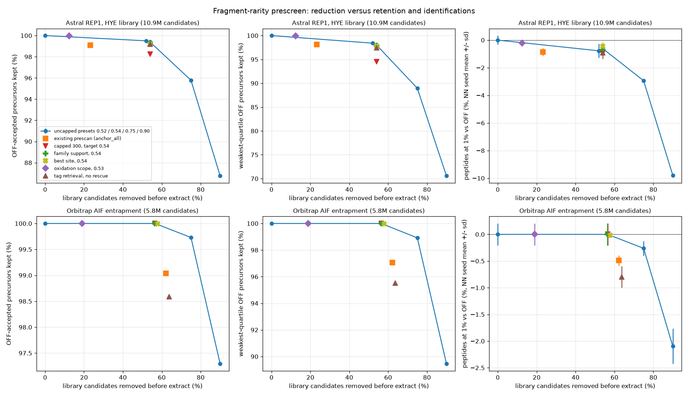

# 34. Prescreen: fragment-rarity candidate filtering

`mumdia prescreen` (`stages/prescreen/`) scores every library candidate on the spectra of its own
isolation window inside its calibrated retention-time bounds and keeps the candidates whose
score exceeds a label-blind calibration quantile. Its purpose is a compute reduction: about half
of the candidates removed before extraction while nearly every identifiable candidate is kept.
It is off by default (`prescreen.enabled = false`).

The same score also runs before any prediction and without retention times
(`prescreen.score_before_prediction`, section 6), together with a database-free tag prefilter
(`prescreen.tag_prefilter`). Those two remove candidates before MS2PIP and DeepLC, so the
predictions are only made for the survivors; section 5b has their measurements.

It is a port of the `tagbench` prototype (`advanced_candidates.scores`, column `lowmz_half`, and
`advanced_filter.export`). The Rust score equals a line-by-line NumPy port of the prototype rule
exactly (maximum absolute difference 0.0 on 1,500 sampled candidates of the AIF entrapment run,
631 of them non-zero; `bench/prescreen/ps_parity.py`).

## 1. The score

For each eligible spectrum and each orientation of the residue-mass array:

- eligible spectrum: its isolation window holds the precursor m/z (`lower <= m < upper`) and its
  retention time lies inside the candidate's `run_windows` bounds (inclusive; unbounded or
  missing bounds mean the whole gradient, as everywhere else in MuMDIA);
- fragments: b and y at `k = 1..L-1` (b1 and y1 included) and charges `1..=min(2, z)`;
  `b = prefix / z + H+`, `y = (suffix + H2O) / z + H+`;
- matching: the nearest peak within 0.005 Da (first on a tie, both edges inclusive); it counts
  only if its intensity is positive, and each peak counts once however many fragments land on it;
- weight: `-ln p`, with `p = min(0.99999, (n_{b-1} + n_b + n_{b+1} + 0.5) / (n_window + 1))`,
  where `n_b` counts the window's spectra holding a peak in bin `b = rint(100 m/z)` (ties to even,
  as numpy). The histogram reads spectra only; no library, label or identification enters it;
- low-m/z evidence below m/z 300 has weight 0.5; there is no intensity threshold;
- the sum is divided by `sqrt(L)`; the candidate's score is the maximum over eligible spectra and
  over the forward and fully reversed orientation.

With both orientations the score is invariant under reversal of the residue array, so a fully
reversed decoy scores exactly as its target. Targets and decoys are scored by the same rule, each
on its own residues, m/z and RT window. Target and decoy survival are close but not equal,
and the entrapment FDP did not rise (section 5).

Peaks are stored as f32 in `spectra_ms2.parquet`. Every comparison is done in f64 on the widened
stored value, so a peak whose f32 value is 500.00500488 is outside `500.0 + 0.005`, as the f64
reference has it, although an f32 comparison would accept it (test
`f32_peaks_are_compared_in_f64_at_the_tolerance_boundary`).

## 2. Calibration

The in-scope candidates are split into a calibration and a reporting half by a seeded SplitMix64
hash of the candidate id (`prescreen.seed`); the split is independent of labels, row order and
thread count. The cutoff is numpy's `quantile(calibration_scores, target, method="higher")`,
that is `sorted[ceil((n - 1) q)]`, and a candidate is kept when its score is strictly greater.
The report gives the reduction on the reporting half, which did not set the cutoff. The cutoff is
recalibrated on every run, for every score definition and scope.

| Preset | Target | Prototype reduction | Reference retention | Weak-reference retention |
|---|---:|---:|---:|---:|
| `sensitive` | 0.52 | 50.29% | 99.70% | 99.24% |
| `balanced` (default) | 0.54 | 52.28% | 99.66% | 99.20% |
| `stringent` | 0.75 | 74.62% | 96.94% | 94.22% |
| `aggressive` | 0.90 | 90.30% | 90.58% | 82.67% |
| `custom` | `prescreen.target` | | | |

The prototype columns are exploratory six-run screening measurements on 1,500 reference and 4,000
sampled background precursors per run. A target does not guarantee the same reduction on another
run; section 5 gives the production measurements.

## 3. Scope

`scope = "modified"` with `scope_mods` (`RESIDUE:Name`, e.g. `M:Oxidation`; `n`/`c` for the
termini) filters only the forms carrying the listed modifications (`scope_match = "any"`) or all
of them (`"all"`). Matching is by residue and mass delta, so named, `UNIMOD:` and numeric spellings
agree. Candidates outside the scope pass through unscored, the cutoff is calibrated within the
scope, and the report gives both denominators: `scope_reduction` (within the class) and
`total_reduction` (over the library). With fewer than `min_calibration` (100) calibration
candidates the filter is bypassed, every candidate kept and the reason written to the report
(`bypass_reason`). Peptidoforms the mass model cannot parse also pass through, counted as
`unparsed_passed_through`.

The modifications defining filter eligibility are separate from the ones allowed in tags: an
oxidation-scoped filter never requires an oxidation-carrying tag.

## 4. Optional components

All are off by default. The prototype measured none of them as an improvement on the score of
section 1 near 50% reduction, so they are for experiments.

| Setting | Component |
|---|---|
| `retrieval = "tags"`, `rescue` | Database-free tag discovery (`tags.rs`) then retrieval: a candidate is retrieved when one of its trimers, in its own residue states and at a fragment charge it can carry, was observed in an eligible spectrum. `rescue = true` (default) scores the unretrieved candidates anyway; `false` drops them. The report separates `retrieval_losses` (unretrieved candidates the score would have kept) from `scoring_losses`. |
| `delayed_modforms` | Retrieve backbone families on backbone states first and examine forms only in retrieved families. Same retrieved set as form-by-form retrieval (tested); `retrieval_forms_skipped_by_family` counts the saving. `retrieval::forms_with_tag` is the delayed generator, equal as a set to enumeration-first generation filtered on the tag (tested with two modification types). |
| `tags.*` | Edge tolerance 0.005 Da neutral (0.005/z m/z), fragment charges 1-2, whole-path RMS sigma 0.003 Da, optional `gap_edges` (two-residue steps, every compatible pair kept, three-peak ladders keyed separately from four-peak ones), `extra_mods`. The alphabet comes from `peptidoforms.fixed_mods`/`variable_mods`: I and L merged, a fixed modification replaces its residue's state, a variable one adds a state; positions the alphabet cannot express break the trimers covering them and are never substituted. There is no peak, degree or path-count cap. |
| `complement_bonus` | Complementary-ion support of observed tag paths: complements of the four path peaks for the candidate's neutral mass, on distinct peaks off the path, never reused; 2/3/4 complements give 1/3, 2/3, 1 times the path fit, times spectrum tag information, divided by `sqrt(L)`. |
| `tag_bonus`, `fasta_bonus` | Spectrum-side tag information times path fit, and the library-side information from the backbone/position index (`retrieval::BackboneIndex`), kept as separate columns. Each distinct trimer counts once. |
| `flank_bonus` | Positioned ladders whose endpoints sit at the candidate's own b or y masses. |
| `mass_hypotheses.*` | Blind neutral-mass hypotheses from tag paths and two or more complementary peaks, per 0.01 Da bin, from a seeded sample of spectra, written to `<out>.mass_hypotheses.parquet` before any candidate is consulted; optional MS1 mono/+1 isotope links within 2 s and max(0.005 Da, 10 ppm); `require_ms1` is a hard gate and off. |
| `trace.*` | Seven-scan same-window pools, bounded 0.01 Da clusters (max - min), intensity-weighted centroids, summed intensity, detection counts and unit per-scan profiles; `merged` (two or more detections) or `unmerged`; `tag_coherence` (minimum pairwise trace cosine of the four path features times fit) or `coherent_fragments` (matched fragments whose trace is compatible with the most intense matched feature, so ladders need not be connected). The single-scan score is unaffected. |
| `localization` | `own` (default), `family_support` (every localization sibling, same residues, charge, label and modification composition, takes the family best; ties and alternatives pass together) or `best_site` (keeps only the best site, ties kept; measured to lose modified references in the prototype). |
| `crowding_exponent` | Divides each spectrum's score by `(n_peaks / mean n_peaks of the window) ^ exponent`, the ratio clamped to [0.25, 4]. It uses the observed peak counts only, no predicted intensity, and corrects the advantage a dense spectrum gives every candidate when there is no retention-time window to restrict the spectra. `0.25` is the value measured in section 5b; default `0`. |
| `repeat_bonus` | Adds `w * R / q95(R)` to `D / q95(D)`, where `R` is, per matched peak, the smaller of its weight and the best weight of the same fragment within two eligible scans and 8 s. Rewards fragments seen in neighbouring scans. Default `0`. |
| `tags.positioned`, `tags.positioned_residues` | For the tag prefilter: a candidate's trimer must sit at the candidate's own b or y position (a ladder anchored at its own fragment masses) rather than anywhere in the spectrum; `positioned_residues` 2 or 3 sets the ladder length. Stricter and measured to lose identifications (section 5b). |

With any component weight positive, the combined score is `base / q95(base) + sum_k w_k c_k /
q95(c_k)` over the calibration half, the prototype's scaling, and the cutoff is calibrated on it.
`write_scores` writes every candidate's base score, combined score, retrieval flag and component
values to `<out>.scores.parquet`.

The complement and flank components re-walk the tag paths per candidate and spectrum, which the
prototype afforded on 5,500 candidates per run but which does not scale to a 10.9M-candidate
library. `mumdia prescreen --sample-candidates N` scores a seeded, label-blind sample of about N
candidates for such measurements; its survivors cover the sample only and are not an extract
allowlist.

## 5. Validation

Measured 2026-10-04 on two acquisitions, binary `391dca1` (`bench/prescreen/`). Each run was
searched once with `mumdia run` (multi-head calibration, `nn_torch`); every arm then reused that
baseline's spectra, run windows, adapted library and mass calibration and ran extract, features,
compete and rescore (3 NN seeds) on its survivors, so arms differ only in the candidate
allowlist. OFF is the same chain without an allowlist. "OFF IDs kept" is the share of precursors
accepted at `precursor_q <= 0.01` in any OFF seed whose candidate survives the screen (Astral
92,852, AIF 11,452); "weak" is the lowest quartile of their extracted apex intensity; "modified"
carries a modification other than carbamidomethylation.

Astral REP1 (HYE library, 10,881,402 candidates, thestral, 128 cores):

| Arm | Removed | OFF IDs kept | Weak kept | Modified kept | Peptides at 1% | vs OFF | Extracted PSMs |
|---|---:|---:|---:|---:|---:|---:|---:|
| OFF | 0% | 100% | 100% | 100% | 83,020 (sd 273) | | 680,218 |
| existing prescan (`anchor_all`, 150 peaks) | 23.3% | 99.10% | 98.14% | 98.68% | 82,304 | -0.86% | 674,202 |
| capped 300, target 0.54 | 54.0% | 98.26% | 94.52% | 96.48% | 82,247 | -0.93% | 560,739 |
| sensitive 0.52 | 52.0% | 99.50% | 98.41% | 99.51% | 82,377 | -0.77% | 623,122 |
| **balanced 0.54** | **54.0%** | **99.39%** | **98.04%** | **99.34%** | **82,508 (sd 139)** | **-0.62%** | 611,852 |
| stringent 0.75 | 75.0% | 95.78% | 88.95% | 95.08% | 80,578 | -2.94% | 429,048 |
| aggressive 0.90 | 90.0% | 86.75% | 70.56% | 83.65% | 74,890 | -9.79% | 230,882 |
| family support 0.54 | 54.0% | 99.33% | 97.88% | 99.37% | 82,426 | -0.72% | 609,778 |
| best site 0.54 | 54.0% | 99.19% | 97.83% | 90.90% | 82,649 | -0.45% | 608,200 |
| oxidation scope 0.53 | 12.4% total, 53.1% of class | 99.98% | 99.93% | 99.44% | 82,854 | -0.20% | 666,508 |
| tag retrieval, no rescue, 0.54 | 54.0% | 99.21% | 97.47% | 99.13% | 82,258 | -0.92% | 611,786 |

Orbitrap AIF entrapment run (E. coli plus a human entrapment, 5,828,348 candidates, hippogriff,
128 cores); FDP is the combined entrapment estimate at 1% peptide q (ratio 0.560632):

| Arm | Removed | OFF IDs kept | Weak kept | Peptides at 1% | vs OFF | Entrapment FDP |
|---|---:|---:|---:|---:|---:|---:|
| OFF | 0% | 100% | 100% | 10,189 (sd 21) | | 1.001% |
| existing prescan | 62.2% | 99.04% | 97.07% | 10,139 | -0.49% | 1.008% |
| capped 300 / sensitive / balanced | 56.5% | 100% | 100% | 10,189 | 0.00% | 1.001% |
| stringent 0.75 | 75.0% | 99.73% | 98.92% | 10,162 | -0.26% | 0.992% |
| aggressive 0.90 | 90.0% | 97.29% | 89.45% | 9,975 | -2.10% | 0.941% |
| family support / oxidation scope | 56.4% / 18.9% | 100% | 100% | 10,189 | 0.00% | 1.001% |
| best site 0.54 | 57.9% | 99.99% | 99.97% | 10,187 | -0.02% | 0.994% |
| tag retrieval, no rescue | 63.7% | 98.59% | 95.53% | 10,108 | -0.80% | 1.009% |

On the AIF run 56.5% of the candidates match no fragment within 0.005 Da in any eligible
spectrum, so at targets 0.52 and 0.54 the cutoff is exactly 0: the filter removes only those,
and extract returns byte-for-byte the same 188,807 PSMs. On Astral the cutoff is 2.98 at 0.54
and the filter does cut scored candidates, costing 0.61% of the OFF precursors and 0.62% of the
peptides (Welch t about -2.9 over 3 seeds). The uncapped presets keep more weak identifications
than the capped-300 control at the same reduction (98.04% against 94.52%), as the prototype
found. The calibration halves held 5,440,408 (Astral) and 2,913,032 (AIF) candidates; the
reporting-half reductions are within 0.03 pp of the targets on Astral.

Target and decoy survival are close but not equal: 46.2% against 45.8% at 0.54 on Astral, 10.8%
against 9.2% at 0.90; identical (43.5%) at 0.54 on AIF, 10.1% against 9.9% at 0.90. The
entrapment FDP does not rise (1.001% OFF, 0.941% to 1.009% across arms).

Retrieval and scoring losses (`bench/prescreen/ps_losses.py`, tag retrieval at 0.54): on Astral
retrieval drops 22.9% of the library and misses 196 OFF precursors (0.21%), 167 of which the
score alone would have kept; the score then loses 542 retrieved ones (0.58%). On AIF retrieval
drops 63.7% of the library, more than the target, which sets the calibrated cutoff to -inf (the
score adds nothing), and misses 162 OFF precursors (1.41%), all of which the score would keep.
The rescue route avoids both and then returns exactly the `retrieval = "all"` survivors.
Delayed enumeration skipped 670,265 Astral forms (6.2%) and 456,172 AIF forms (7.8%) whose
family had no backbone tag, with the same retrieved set. Tag discovery walked 357M paths on the
293,271 Astral spectra in about 47 s at 9.8 GB, and 23M on AIF.

Optional components on seeded 100,000-candidate samples (864 Astral OFF precursors in the
sample, 215 on AIF; one reference is 0.12 pp on Astral), all at about 54% reduction:

| Astral sample | OFF IDs kept | Weak kept | Component time |
|---|---:|---:|---:|
| plain score (0.54) | 99.65% | 99.03% | |
| + complement 0.25 | 99.42% | 97.58% | 52 s |
| + tag information 0.25 | 98.73% | 96.14% | 14 s |
| + tag and library information 0.25 each | 97.45% | 92.75% | 15 s |
| + flank 0.25 | 99.65% | 98.55% | 15 s |
| + mass hypotheses 0.25 (512 spectra, MS1) | 99.54% | 98.55% | 18 s |
| + trace, tag coherence 0.25 | 98.73% | 95.17% | 13 s |
| + trace, coherent fragments 0.25 | 99.42% | 98.07% | 7 s |
| + trace, unmerged, coherent fragments 0.25 | 99.65% | 99.03% | 7 s |
| tag retrieval no rescue / with gap edges | 99.54% / 99.65% | 98.55% / 99.03% | 15 s / 111 s |
| stringent 0.75: plain / + complement 0.25 | 95.83% / 96.06% | 89.86% / 87.44% | |

None improves on the plain score near 50% reduction, which is the prototype's conclusion; on
the AIF sample every variant equals the plain score because its cutoff is 0. Gap edges multiply
the paths sixteenfold (5.8 billion on Astral) for no retention change.

**Exact speed-ups.** Two changes leave every score bit-identical and only skip work: a
per-spectrum 0.01 Da bin-occupancy bitmap, which answers "is any peak within tolerance" without
searching the peak list, and upper-bound pruning over a per-window inverted bin index, which
skips a spectrum once the bins a candidate could still match cannot beat its best spectrum so
far (all peaks in one bin share one weight, with a 1e-9 margin). Over whole libraries the scores
were identical to the unpruned ones (10,881,402 Astral and 203,443,548 immunopeptidomics
candidates, maximum absolute difference 0). Astral without retention times: 4:40 -> 3:21
(bitmap) -> 1:11 (pruning); immunopeptidomics with retention times: 18:53 -> 6:42 (scoring
1,021 s -> 338 s).

**Run time and memory: no saving at this scale.** Clean sequential timing, two repeats, nothing
else running:

| | Astral OFF | Astral balanced | AIF OFF | AIF balanced |
|---|---:|---:|---:|---:|
| prescreen | | 19.7 s, 4.2 GB | | 9.7 s, 2.4 GB |
| extract | 23.8-25.8 s, 5.4 GB | 25.3-26.3 s, 5.2 GB | 8.8-12.2 s, 3.7 GB | 10.6-12.8 s, 3.6 GB |
| existing prescan | | 5.7 s, 3.3 GB | | 2.2 s, 1.3 GB |

Extract is peak-major: its cost follows the spectra and the peaks it probes, not the number of
library candidates, so removing 54% of the candidates did not shorten it, and the prescreen's
own pass is added on top. What shrinks downstream is the extracted PSM count, by 10% on Astral
(680,218 to 611,852; none on AIF), which reduces features, compete and rescore proportionally.
A net gain is therefore plausible only where per-candidate cost dominates (much larger
libraries, as in docs/32, or a candidate-major extract). That case is measured in section 5b on a
203M-candidate immunopeptidomics library, where extract, features and rescore roughly halve. The
prescreen stays off by default.



## 5b. Before prediction, without retention times

Measured 2026-10-04 and 2026-10-05 (`bench/prescreen/ps_rtfree.sh`, `ps_crowd.sh`,
`ps_tagpre.sh`, `ps_mods.sh`). "Kept" is again the share of an unfiltered search's accepted
precursors whose candidate survives; "removed" is the share of the library or peptidoform table.

**Tag prefilter** (`tag_prefilter`, plain trimers, end to end):

| Data | Removed | Kept | Run wall | Peptides vs OFF |
|---|---:|---:|---|---:|
| Orbitrap AIF entrapment library | 55.6% | 100% | 3.0 -> 2.1 min | +0.33%, FDP 1.001% -> 1.028% |
| Orbitrap AIF, E. coli FASTA (MS2PIP + DeepLC) | 58.2% | 100% | 11.1 -> 4.5 min, 25.4 -> 14.7 GB | -0.31% |
| Astral REP1, HYE library | 16.5% | 100% | 5.0 -> 5.5 min | -0.20% |
| Astral immunopeptidomics, 203M library | 0% | 100% | | |

It works where spectra are sparse relative to the library and does nothing on dense
immunopeptidomics spectra, where almost every trimer occurs somewhere in each window. Positioned
tags (standalone) remove more and lose identifications: three residues AIF 85% / 85% kept, Astral
31.8% / 95.9%, immunopeptidomics 16.1% / 99.1%; two residues AIF 63.8% / 98.9%, Astral 17.1% /
99.96%, immunopeptidomics 0.5%.

**Fragment-rarity score without retention times** (`score_before_prediction`; standalone
reduction / kept):

| Data | Variant | 25% | 40% | 52% | 54% | 75% |
|---|---|---:|---:|---:|---:|---:|
| Astral REP1 | plain | 99.19% | 96.29% | 92.89% | | |
| Astral REP1 | crowding 0.25 | 99.62% | 97.76% | 95.24% | | |
| Astral REP1 | crowding 0.25 + repeat 0.1 | 99.71% | 98.09% | 95.76% | | |
| immunopeptidomics | plain | | | | 96.03% | |
| immunopeptidomics | crowding 0.25 | 99.90% | 99.60% | 99.12% | 99.04% | 96.91% |

Without a retention-time window a dense spectrum anywhere in the gradient favours every
candidate, which crowding corrects; on immunopeptidomics data the crowding-adjusted score keeps
as much as the score with calibrated retention times (98.91% at 54%). On the AIF entrapment run
it removes 56% at 100% kept. The plain no-RT score at 52% cost 6.5% of the Astral peptides end to
end.

**End to end, immunopeptidomics** (AT10265RJB against the uncalibrated 203,443,548-candidate
library with in-run multi-head DeepLC, 128 threads, `nn_torch`, 3 NN seeds; balanced, crowding
0.25):

| | OFF | Before prediction |
|---|---:|---:|
| library searched | 203.4M | 93.6M |
| peptides at 1% | 13,781 (sd 135) | 13,295 (sd 121), -3.5% |
| wall | 3:04 | 2:19 |
| peak resident | 105 GB | 52.7 GB |
| screen + sub-library | | 44.8 + 6.4 min |
| deeplc-multihead / extract / features / rescore | 36.8 / 85.8 / 37.2 / 15.5 min | 20.8 / 38.7 / 17.4 / 8.3 min |

The screen kept 96.99% of the 14,627 precursors accepted in any OFF seed; the 440 it removed
are the net loss, the rest is seed-to-seed exchange (615 lost and 679 gained among survivors).
The standalone 99.04% above was measured against a search of the calibrated library, which
accepts a different set. With calibrated retention times instead (`enabled`, after the
calibration) the same library lost 1.19% of the peptides (not significant; standard deviation
of OFF 275) at 54% and 1.61% at 75%, and extract went from 39.4 to 25.6 / 16.2 min, features from
11.2 to 7.3 / 4.3, rescore from about 15 to 7 / 4.4.

**End to end, a large modification search** (Orbitrap AIF, E. coli FASTA, MS2PIP + DeepLC, Phospho
STY, Acetyl K, Deamidated NQ and Oxidation M, 3 NN seeds): the prescreen before prediction sent
3,217,290 of 8,750,640 peptidoforms to prediction (63% removed); peptides 9,987 -> 9,945
(-0.4%, within the seed spread), wall 38:37 -> 12:15, peak 89.6 -> 26.4 GB.

## 6. Use

Inside a run there are two independent switches:

- `prescreen.enabled`: the fragment-rarity score of sections 1-2, after `rt-im-train`, inside
  each candidate's calibrated (predicted) RT window, on the library extract will read; extract
  searches only its survivors (`configs/examples/prescreen-balanced.json`).
- `prescreen.tag_prefilter`: the database-free tag prefilter, before any prediction and
  without retention times. Tags are discovered from the spectra alone (section 4, `tags.*`); a
  candidate is kept when one of its trimers, in its own residue states and at a fragment charge
  it can carry, was observed in its isolation window anywhere in the run, or when no trimer of it
  can be expressed in the tag alphabet. No fragment score is computed. In FASTA mode the spectra
  are converted first, the peptidoform table is filtered (its precursor m/z is computed from
  sequence and charge) and only the kept peptidoforms go to MS2PIP and DeepLC
  (`peptidoforms_tag_prefiltered.parquet`); the library cache is not used, because the library
  then depends on the run. With an imported library the kept candidates become a sub-library
  (`library_tag_prefiltered_*.parquet`, not pair-linked: the prefilter is label-blind) before the
  seed search and the multi-head DeepLC calibration. Every later stage uses the predicted
  retention times as usual, including the fragment-rarity score when `enabled`. Single-file
  `run` only; `run-experiment` refuses it, because one library serves every run and the
  survivors would first have to be united over runs. On the CI fixture it removed 26% of the
  peptidoforms before prediction and the run identified the same 116 of 160 planted peptides.

Standalone, `mumdia prescreen --tags-only` without `--run-windows` is the same prefilter.

- `prescreen.score_before_prediction`: the fragment-rarity score of sections 1-2 at the same
  place as the tag prefilter, before prediction and without retention times: every candidate is
  scored over the whole gradient of its isolation window, with the preset or target and
  `crowding_exponent` of the `prescreen` block (0.25 is the measured setting). With both set a
  candidate must pass both (`prediction_prefilter_survivors.parquet`). Single-file `run` only,
  for the reason above. Section 5b has the measurements; on dense data it costs identifications
  (-3.5% on the immunopeptidomics run at balanced), so the strength is a trade between run time
  and memory and sensitivity.

`prescreen.enabled` is not yet supported with `groups.window_groups > 1` (validation rejects the
combination). The two prefilters before prediction work with window groups: they run before the
band plan, which then splits the reduced library.

Standalone, for a run directory written by `mumdia run`:

```text
mumdia prescreen --ms2 RUN/spectra/spectra_ms2.parquet \
  --lib-precursors RUN/fragment_library_precursors_multihead.parquet \
  --run-windows RUN/run_windows.parquet --out survivors.parquet \
  --preset balanced --write-scores
mumdia extract ... --restrict-candidates survivors.parquet
```

`--preset`, `--target` and `--top-peaks` override the configuration. `configs/examples/
prescreen-oxidation.json` is the oxidation-only filter; `prescreen-components.json` enables tag
retrieval with rescue, the 0.25 complementary bonus and family support.

The validation campaign is reproducible with `bench/prescreen/ps_val.sh` (baseline run, then
paired arms that share the baseline's spectra, run windows, adapted library and mass
calibration), `bench/prescreen/ps_ext.sh` (component arms), `bench/prescreen/ps_agg.py`
(summary) and `bench/prescreen/ps_plot.py` (figures).
